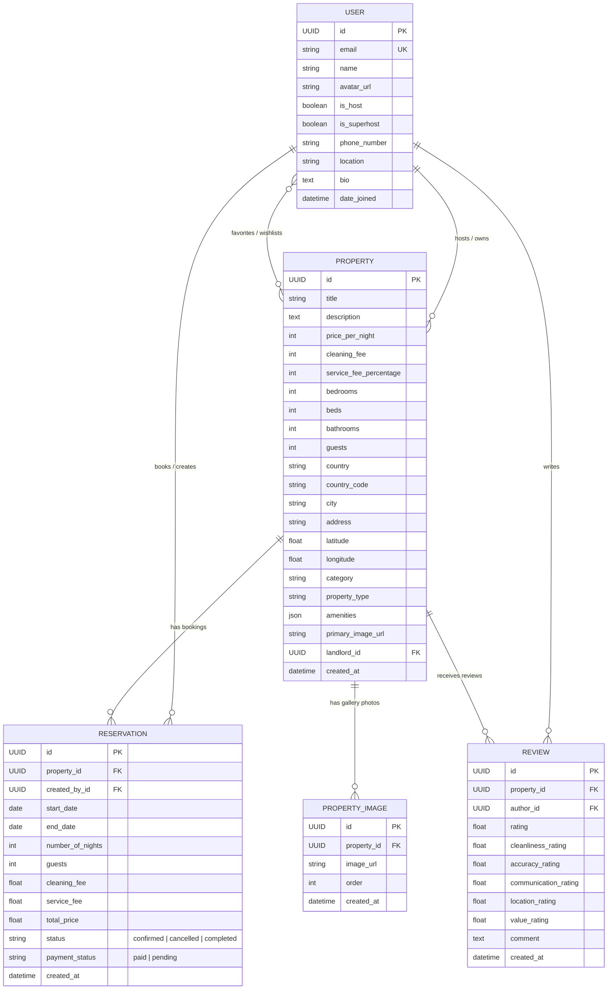

# Airbnb Fullstack Web Application

A full-featured clone of the **Airbnb** web marketplace built for the **SDE Fullstack Assignment**. Replicates Airbnb's design system, user experience, booking workflows, host management (CRUD), interactive search, photo galleries, reviews, and date availability engine.

---

## 📸 Core Features & Highlights

- **Explore & Smart Search**: Instant location/destination keyword search, country selection, check-in/check-out date range filtering with calendar, guest capacity steppers, and 12+ categories (Beachfront, Cabins, Mansions, Countryside, Lakefront, Castles, etc.).
- **Comprehensive Filters Modal**: Price range sliders (min/max), property types (Villa, House, Chalet, Loft), bedroom/bed/bathroom counters, and amenities multi-selection (Wifi, Pool, AC, Kitchen, Dedicated Workspace, Free Parking, etc.).
- **Interactive Map View**: One-click toggle between responsive card grid and interactive OpenStreetMap/Leaflet view with custom Airbnb pricing pins.
- **Listing Detail Experience**:
  - Classic **5-Photo Gallery Grid** + Fullscreen **Photo Lightbox Modal** with thumbnail strip.
  - ⭐ Rating score aggregation and detailed category breakdown (Cleanliness, Accuracy, Communication, Location, Value).
  - Categorized amenities list with icons, sleeping arrangements, host profile with Superhost badge.
  - Interactive property location map.
- **End-to-End Booking & Mocked Checkout**:
  - Live price calculation (`$Price × Nights` + Cleaning fee + 14% Service fee).
  - Date overlap validation preventing double-bookings.
  - **Mocked Checkout Confirmation Modal** with payment method selection (Credit/Debit Card, UPI / Instant Pay, Apple Pay) and instant booking confirmation.
- **My Trips Dashboard**:
  - Tabbed views: *Upcoming Trips*, *Past Stays*, and *Cancelled*.
  - Instant one-click **Cancellation** that unblocks dates on the backend.
  - **Review Submission Modal** allowing travelers to submit star ratings & feedback.
- **Host Dashboard & Full CRUD**:
  - Host statistics: Total Listings, Active Bookings, and Confirmed Revenue ($).
  - **Create Listing**: Multi-step wizard supporting category, property type, price, rooms, location, amenities, and photo upload / URLs.
  - **Edit Listing**: Prefilled modal to update pricing, description, title, amenities, and details.
  - **Delete Listing**: Confirmation-guarded deletion.
  - **Guest Reservations Table**: Review incoming bookings on host properties with guest name, dates, payout, and status.
- **Wishlists / Favorites**: Optimistic toggle with animated heart and dedicated Wishlists page.
- **Evaluation Demo Logins**: 1-click preset logins in Login Modal for **Superhost**, **Mountain Host**, and **Guest Traveler**.

---

## 🛠️ Technical Stack

- **Frontend**: Next.js 14 (App Router, TypeScript, Tailwind CSS, Zustand, Date-fns, React-date-range)
- **Backend**: Python 3, Django 5.x, Django REST Framework (DRF), SimpleJWT, Dj-Rest-Auth
- **Database**: SQLite (configured with relational models, foreign keys, and indexes)
- **Maps**: OpenStreetMap / Leaflet embedded maps with pricing pins

---

## 🗄️ Database Schema & Entity Relationships



---

## 🚀 Quick Setup & Run Instructions

### Prerequisites
- Python 3.10+
- Node.js 18+ & npm

---

### 1. Backend Setup (Django REST API)

```bash
# Navigate to backend directory
cd airbnb_backend/djangobnb_backend

# (Optional) Create and activate virtual environment
python3 -m venv venv
source venv/bin/activate  # On Windows: venv\Scripts\activate

# Install dependencies
pip install -r requirements.txt

# Run migrations
python manage.py migrate

# Seed database with realistic properties, multi-image galleries, reviews & demo users
python manage.py seed_data

# Run Django test suite to verify all APIs
python manage.py test

# Start the Django development server (runs on http://localhost:8000)
python manage.py runserver 8000
```

---

### 2. Frontend Setup (Next.js 14)

```bash
# Open a new terminal tab and navigate to frontend directory
cd airbnb_frontend

# Install dependencies
npm install

# Verify .env.local exists with:
# NEXT_PUBLIC_API_HOST=http://localhost:8000
# NEXT_PUBLIC_WS_HOST=ws://localhost:8000

# Start the Next.js development server (runs on http://localhost:3000)
npm run dev
```

Open **[http://localhost:3000](http://localhost:3000)** in your browser to experience the application.

---

## 🔑 Demo Evaluation Accounts

Click **Log in** in the top navigation bar to access one-click fast evaluation presets:

| Role | Name | Email | Password | What to Test |
|---|---|---|---|---|
| **Superhost** | Priya Sharma | `superhost@airbnb.com` | `password123` | Host dashboard, Goa villas, high earnings, edit/delete listings |
| **Mountain Host** | Rohit Verma | `host1@airbnb.com` | `password123` | Himalayan chalets, chalet bookings, incoming guest reservations |
| **Heritage Host** | Ananya Patel | `host2@airbnb.com` | `password123` | Lakeside haveli listings, guest reviews |
| **Traveler Guest** | Rahul Mehta | `guest@airbnb.com` | `password123` | End-to-end booking flow, checkout modal, My Trips, cancel booking, write reviews |

---

## 📡 API Reference Overview

### Property Endpoints (`/api/properties/`)
- `GET /api/properties/` — List & search properties with query parameters (`query`, `category`, `country`, `city`, `min_price`, `max_price`, `numGuests`, `numBedrooms`, `numBathrooms`, `numBeds`, `amenities`, `checkIn`, `checkOut`, `page`, `limit`).
- `GET /api/properties/<uuid:pk>/` — Get full property details, images gallery, host info, and reviews breakdown.
- `POST /api/properties/create/` — Create a new listing as an authenticated host.
- `PUT /api/properties/<uuid:pk>/edit/` — Edit listing details (owner only).
- `DELETE /api/properties/<uuid:pk>/delete/` — Delete listing (owner only).
- `POST /api/properties/<uuid:pk>/book/` — Book property with date conflict & capacity validation.
- `GET /api/properties/<uuid:pk>/reservations/` — Get active booked date intervals for calendar blocking.
- `POST /api/properties/<uuid:pk>/toggle_favorite/` — Toggle favorite/wishlist state.
- `GET /api/properties/<uuid:pk>/reviews/` — List reviews & rating category averages.
- `POST /api/properties/<uuid:pk>/reviews/` — Submit a guest review with star ratings.

### User & Host Endpoints (`/api/auth/`)
- `POST /api/auth/login/` — Authenticate user and receive JWT tokens.
- `POST /api/auth/register/` — Register a new traveler or host account.
- `GET /api/auth/myreservations/` (or `/api/auth/trips/`) — List authenticated user's bookings.
- `POST /api/auth/reservations/<uuid:pk>/cancel/` — Cancel booking and immediately unblock calendar dates.
- `GET /api/auth/host/dashboard/` — Host analytics (total listings, bookings count, revenue) and incoming guest reservations.
- `GET /api/auth/<uuid:pk>/` — Public host profile and their active listings.

---

## 🧪 Testing & Verification

Run the comprehensive automated test suite in the backend:
```bash
python manage.py test
```
The test suite validates:
1. Property listing, category filtering, search keyword querying, and price range filters.
2. Property details serialization with amenities and host info.
3. Host authorization for property creation, editing, and deletion.
4. End-to-end booking flow and rejection of overlapping date ranges and guest overflows.
5. Wishlist toggle functionality.
6. Reviews submission and rating score aggregation.
