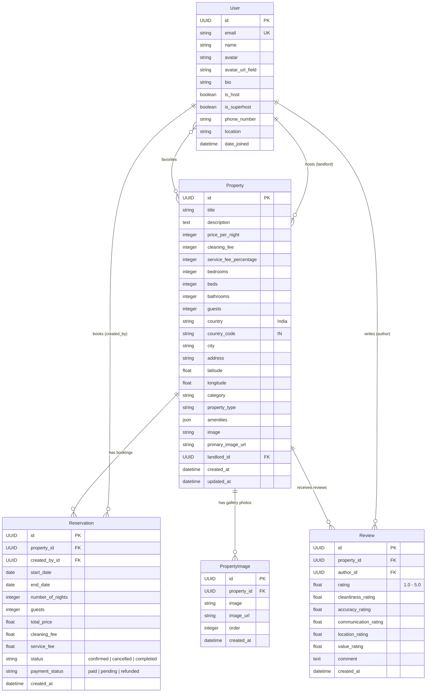

# Airbnb India Web App - Backend API (Django & DRF)

A robust, production-ready RESTful backend powering the **Airbnb India** Web Application clone. Built with **Python**, **Django 4.2+**, **Django REST Framework (DRF)**, **SimpleJWT**, and **SQLite**.

Featuring curated stays across **Goa, Manali, Udaipur, Kerala, Rishikesh, Mumbai, Bengaluru, Jaipur, Coorg, Gulmarg, Pondicherry, Ladakh, Andaman, Munnar, Varanasi, and Lonavala**.

---

## Table of Contents
1. [Tech Stack](#tech-stack)
2. [Architecture Overview](#architecture-overview)
3. [Database Schema](#database-schema)
4. [Quickstart & Setup Instructions](#quickstart--setup-instructions)
5. [Demo User Accounts](#demo-user-accounts)
6. [API Reference](#api-reference)
7. [Testing & Verification](#testing--verification)
8. [Assumptions & Mocked Services](#assumptions--mocked-services)

---

## Tech Stack
- **Framework**: Django 4.2 LTS / Django REST Framework (DRF)
- **Database**: SQLite (default zero-configuration embedded database `db.sqlite3`)
- **Authentication**: JWT Auth via `django-rest-auth` and `djangorestframework-simplejwt`
- **Real-Time Messaging**: Django Channels & Daphne ASGI
- **Image Processing**: Pillow
- **CORS**: `django-cors-headers`

---

## Architecture Overview

The backend follows clean separation of concerns and modular service architecture:
- **`useraccount`**: Custom user model, JWT token registration/login, user profile management, landlord profile view, guest trip reservations, and the Host Dashboard.
- **`property`**: Property listing CRUD, multi-image galleries, multi-parameter search engine (category, location, price range, guest count, amenities, date overlap exclusion), date validation booking engine, review/rating aggregation, and wishlist/favorites.
- **`chat`**: WebSocket consumer endpoints and conversation threads between guests and hosts.

```
djangobnb_backend/
├── djangobnb_backend/       # Project core configuration (settings, ASGI/WSGI, root URLs)
├── useraccount/             # Authentication, Profiles, Trips, and Host Dashboard
│   ├── models.py            # Custom User model with host/superhost attributes
│   ├── serializers.py       # User and profile serializers
│   ├── api.py               # User, profile, and host dashboard endpoints
│   ├── urls.py              # Auth & profile routing
│   └── tests.py             # User and profile test suite
├── property/                # Listings, Bookings, Reviews, and Wishlists
│   ├── models.py            # Property, PropertyImage, Reservation, Review models
│   ├── serializers.py       # Listing, gallery, booking, and review serializers
│   ├── api.py               # Search, CRUD, booking with overlap validation, reviews
│   ├── urls.py              # Property and booking routing
│   ├── management/
│   │   └── commands/
│   │       └── seed_data.py # Automatic India database seeder
│   └── tests.py             # Search, booking validation, and review tests
├── chat/                    # Real-time messaging and conversation threads
└── media/                   # Uploaded images and media storage
```

---

## Database Schema



---

## Quickstart & Setup Instructions

### 1. Prerequisites
- Python 3.9, 3.10, 3.11, or 3.12 installed.

### 2. Navigate to Project
```bash
cd djangobnb_backend
```

### 3. Create & Activate Virtual Environment
```bash
python3 -m venv venv
source venv/bin/activate
```

### 4. Install Dependencies
```bash
pip install -r requirements.txt
```

### 5. Apply Migrations (SQLite Database)
```bash
python manage.py migrate
```

### 6. Seed Indian Airbnb Sample Data
Populates the database with 16+ curated Indian properties across Goa, Manali, Udaipur, Kerala, Mumbai, Bengaluru, Jaipur, etc., complete with verified Superhosts, multi-image galleries, existing bookings, and authentic reviews:
```bash
python manage.py seed_data
```

### 7. Run the Development Server
```bash
python manage.py runserver 8000
```
Backend API will be accessible at: `http://localhost:8000`

---

## Demo User Accounts

All seeded accounts share the default password: **`password123`**

| Role | Email | Name | Location / Details |
| :--- | :--- | :--- | :--- |
| **Superhost** | `superhost@airbnb.com` | Priya Sharma | Goa, India (Luxury villas & coastal retreats) |
| **Superhost** | `host1@airbnb.com` | Rohit Verma | Manali, Himachal Pradesh, India (Himalayan chalets & treehouses) |
| **Host** | `host2@airbnb.com` | Ananya Patel | Udaipur, Rajasthan, India (Royal Heritage Havelis & Palaces) |
| **Guest** | `guest@airbnb.com` | Rahul Mehta | Bengaluru, Karnataka, India (Digital Nomad with active trips & wishlist) |

---

## API Reference

### 1. Properties & Search (`/api/properties/`)

| Method | Endpoint | Description | Auth Required |
| :--- | :--- | :--- | :--- |
| `GET` | `/api/properties/` | Search & list properties with multi-criteria filters | No |
| `GET` | `/api/properties/<id>/` | Detailed view of a single property (photos, amenities, reviews, host) | No |
| `POST` | `/api/properties/create/` | Create a new property listing (Host CRUD) | Yes |
| `PUT / PATCH` | `/api/properties/<id>/edit/` | Edit an existing property listing (Owner only) | Yes |
| `DELETE` | `/api/properties/<id>/delete/` | Delete a property listing (Owner only) | Yes |
| `POST` | `/api/properties/<id>/book/` | Book property dates (with overlap conflict validation) | Yes |
| `GET` | `/api/properties/<id>/reservations/` | Blocked date ranges for availability calendar | No |
| `POST` | `/api/properties/<id>/toggle_favorite/` | Toggle wishlist favorite for property | Yes |
| `GET` | `/api/properties/favorites/` | List current user's favorited properties | Yes |
| `GET` | `/api/properties/<id>/reviews/` | List all reviews for a listing | No |
| `POST` | `/api/properties/<id>/reviews/` | Submit a review & ratings for a stay | Yes |

#### Search Query Parameters (`GET /api/properties/`):
- `query` / `search`: Full-text keyword search across title, description, city, country, address (e.g. `?query=Goa`, `?query=Himalayan`).
- `country`, `city`: Exact or case-insensitive location filter (e.g. `?city=Manali`).
- `category`: Category filter (e.g. `Beachfront`, `Cabins`, `Mansions`, `Iconic Cities`, `Trending`, `Tiny Homes`, `Countryside`, `Lakefront`, `Design`).
- `propertyType`: Filter by property type (`Villa`, `Apartment`, `Chalet`, `Heritage Haveli`, `Houseboat`, `Treehouse`, etc.).
- `minPrice`, `maxPrice`: Nightly price range filter in INR (e.g. `?minPrice=3000&maxPrice=10000`).
- `numGuests`, `numBedrooms`, `numBathrooms`, `numBeds`: Minimum capacity filters.
- `amenities`: Comma-separated list of required amenities (e.g. `Wifi,Pool,Indoor fireplace`).
- `checkIn`, `checkOut`: Date range availability filter (automatically excludes properties with conflicting active bookings).
- `landlord_id`: Filter listings by host.
- `is_favorites`: Return only properties favorited by the logged-in user.
- `page`, `limit` / `page_size`: Pagination support.

---

### 2. User Accounts & Trips (`/api/auth/`)

| Method | Endpoint | Description | Auth Required |
| :--- | :--- | :--- | :--- |
| `POST` | `/api/auth/register/` | Register a new user account | No |
| `POST` | `/api/auth/login/` | Log in with email & password, returns JWT tokens | No |
| `POST` | `/api/auth/logout/` | Log out user | Yes |
| `POST` | `/api/auth/token/refresh/` | Refresh JWT access token | No |
| `GET` | `/api/auth/me/` | Retrieve authenticated user's profile | Yes |
| `PATCH / PUT` | `/api/auth/me/update/` | Update profile information, avatar, or host status | Yes |
| `GET` | `/api/auth/myreservations/` | "My Trips" view - user's booked stays and status | Yes |
| `POST` | `/api/auth/reservations/<id>/cancel/` | Cancel a booking (frees up calendar dates) | Yes |
| `GET` | `/api/auth/host/dashboard/` | Host Dashboard - owned listings, incoming bookings, earnings | Yes |
| `GET` | `/api/auth/<id>/` | Public landlord profile, superhost badge, and their listings | No |

---

## Testing & Verification

Run the comprehensive test suite:

```bash
python manage.py test
```

Output:
```
Ran 13 tests in 4.32s
OK
```

---

## Assumptions & Mocked Services

- **Payment Processing**: Mocked checkout flow as specified in the assignment. Upon submitting a booking request with valid dates, the reservation status is automatically set to `confirmed` with `payment_status: 'paid'`.
- **Map & Geolocation**: Properties store precise GPS `latitude` and `longitude` coordinates for Indian destinations, enabling interactive map pins.
- **Image Storage**: Supports local file uploads (`/media/uploads/`) and external high-resolution CDN/Unsplash URLs for seamless demo seeding and fast evaluation.


